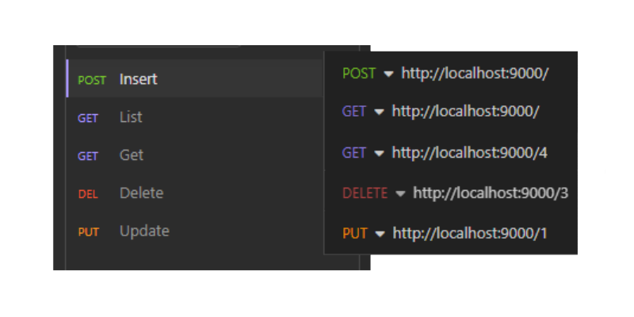

# Todo API

Este é um projeto desenvolvido com o objetivo de aplicar conhecimentos aprendidos em golang. O projeto em questão é do canal **[Aprenda Golang](https://www.youtube.com/@AprendaGolang)**.

Foi muito importante para a fixação do conhecimento ver na prática como são configuradas as rotas e endpoints.

************************Observações:************************

Como esse é um projeto mais rápido, o ID está sendo feito sequencialmente, o que não é recomendado. Assim como os códigos que estão sendo retornados da API são todos 200, mesmo se for negada uma request.

### Rotas da API

